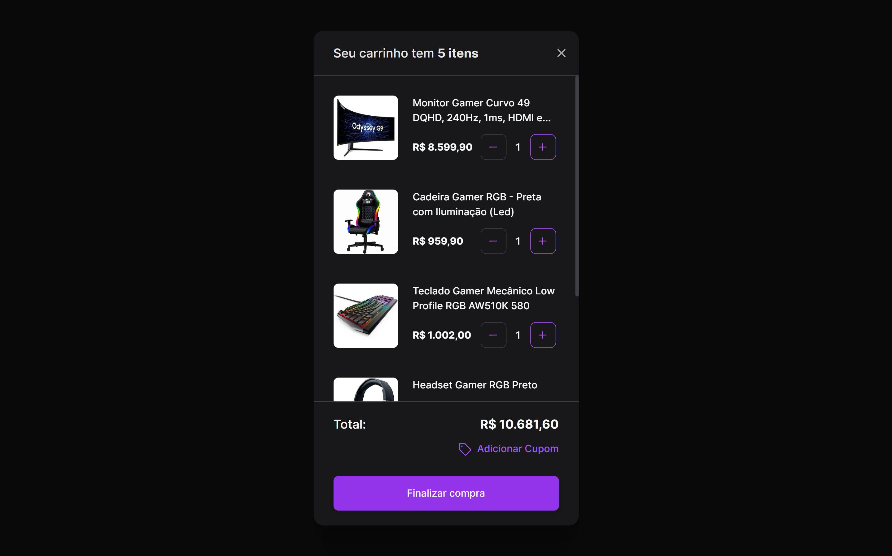

<h1 align="center"> Carrinho de Compras - BoraCodar#21 </h1>

[Clique aqui para acessar](https://maik-emanoel.github.io/shopping-cart/)

## 🚀 Tecnologias

Esse projeto foi desenvolvido com as seguintes tecnologias:

- HTML
- CSS
- JavaScript
- Git and GitHub

## 💻 Projeto

O projeto Carrinho de Compras é uma interface de um componente muito utilizado em e-commerce. 

Projeto construído a partir do layout proposto no desafio [#BoraCodar21](https://boracodar.dev/) realizado pela [Rocketseat](https://rocketseat.com.br).
Após o desenvolvimento do projeto inicial, adicionei novas features, tais quais:

- Layout responsivo (Adaptado para telas menores);
- Botões funcionais;
- Animações/efeitos hover;
- Atualização do valor total de compra;
- Mensagem de confirmação de compra;
- Entre outras pequenas modificações.

## 🔖 Layout

Você pode visualizar o layout do projeto proposto através [DESSE LINK](https://www.figma.com/community/file/1243194167725942248). É necessário ter conta no [Figma](https://figma.com) para acessá-lo.